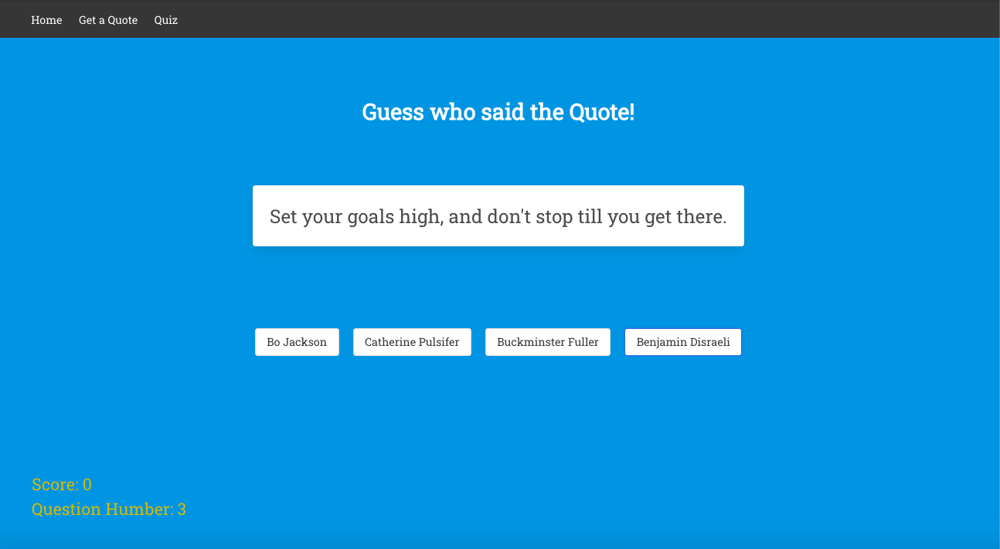

# SEI-Project-2

# Motivational Maddening (2 days)

Consuming an API and displaying it with a React frontend

In this pair coding project, we were tasked with searching for an API and using this, create a frontend React application.

### Team Members

- Max Morgan-Giles
- Daniel Fernandez De Ascençao



URL - https://bit.ly/2Z062pk

### Dependencies:

yarn add:

- react-router-dom
- react
- react-dom
- node-sass
- bulma
- axios

## General approach taken:

As this project was only two days there was a big time pressure to get it finished. Upon being set the challenge me and my partner set about coming up with ideas of what to do and searching for API's. The idea of a quiz based game seemed a good balance for the project as this had some challenging logic behind the game while dealing with React state and JSX which we only had been learning for a few days prior to this. Having found an API of motivational quotes we decided to press on and work with this. In hindsight we might have picked a more complicated API as the data stucture had just two keys of author and quote and this limited the amount of content we had available to show it the frontend.

```javaScript
// Accessing the API

 React.useEffect(() => {
    const getData = async () => {
      try {
        const { data } = await getAllQuotes()
        const filteredData = data.filter(item => {
          return item.author
        })
        setQuotes(filteredData)
        setGame(1)
        setCorrectOption(0)
      } catch (err) {
        console.log(err)
      }
    }
    getData()
  }, [])
```

During this process communication was key, as we were not using git repositories we had to be very clear on which parts we were doing and constantly share code. Having set up the request for the API's data we began getting the data to show on the screen. This was challenging as the concept of setting state and using a conditional to check for the information before rendering was still very new to me. Having got this working my partner set about building the logic behind the quiz page. As he did this I worked on making the homepage, quote show and quizcard.

```jsx
// Quiz Card JSX

function QuizCard(quizQuote) {
  return (
    <div className= "column is-half-desktop is-one-third-tablet">
      <div className="card">
        <div className="card-content">
          <p>{quizQuote.text}</p>
        </div>
        <div className="card-footer">
          <div className="card-footer-title">{quizQuote.author}</div>
        </div>
      </div>
    </div>
  )
}
```
Having hooked up these pages and using Bulma to style them I began working on a piece of logic to randomly select a quote. This was useful for both the quotes show page and the quiz page as for both we needed to randomly select a quote from the API. While I had done this my partner had worked on the basic structure of the quiz and had the timeframe of the quiz working with the quote and four authors. This posed are first big challenge as the API had multiple quotes from the same author. This meant that when selecting random authors for the wrong answers we would sometimes get duplicate values and even the right answer twice. Using a while loop to check if the new random author was already present in the answer options array we managed to stop these duplicate values.

We then had the problem of randomly positioning the right answer into the four buttons. While I worked on this my partner sorted out the logic behind the scoring. The idea behind my logic was to randomly select a number between one and four. In doing this it would randomly select one of the four different combinations of the position of the right answer in the array. Using an if statement with loops and pushing at different orders I manged to achieve this. We then dealt with are final problem of having authors of null in the data. Using a filter to solve this we made final adjustment as stylistic improvements and made sure are code was in sync with each other

### Major hurdles and unsolved problems

Major hurdles included mapping and displaying content through JSX, using state, passing down data to components and the timeframe for this project.

In terms of unsolved problems, I think that the styling was quite basic due to the time spend on getting everything else working and using a framework for the first time. Similarly picking a very simple API in the end was a disadvantage and so there are lots of things I would have done differently given the chance to do it again but it was a very good experience.

### Wins

This was a very good learning experience for me as pair coding taught me a lot about how important communication is when coding in teams. Particularly at the beginning of this project I feel that we were so concerned for time that we just wanted to get coding as quickly as possibly and soon found out that a clear plan and communication were best and taking a step back to allow time for this really helped us. This was a huge learning curve being so new to React and while this was defintely my most challenging project it was hugely beneficial for my development.

### Key learning

Key learning included requests, database structures, turnary operators and using React.

### Future Features

Ideas for future features include re-styling, adding animations and being able to play against another player.
